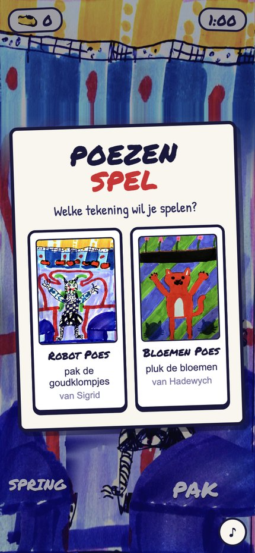
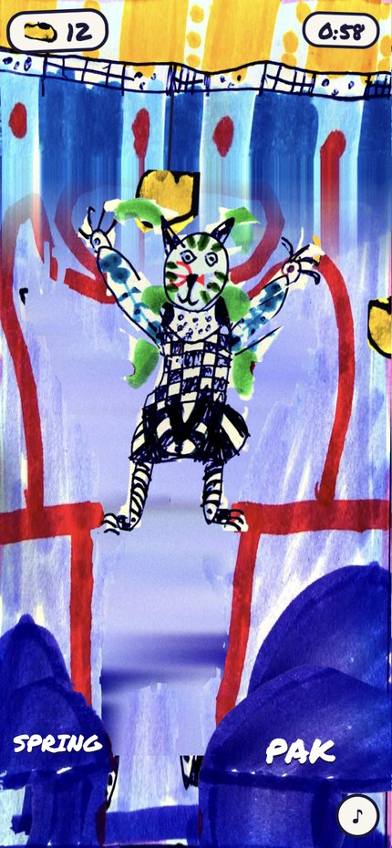
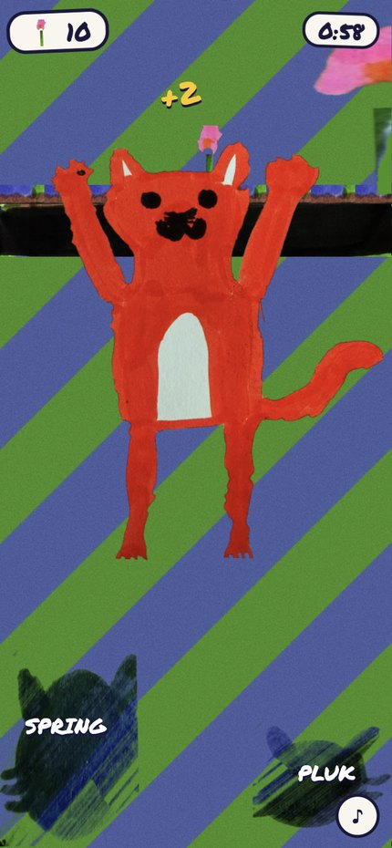

# Poezenspel

Twee browserspellen, elk volledig gebouwd uit één tekening van een kind. Bij de start kies je welke je speelt.

### ▶ [Spelen: koenkooi.github.io/Robotkitty](https://koenkooi.github.io/Robotkitty/)

> **In English:** two browser games, each built entirely from one child's marker drawing — every sprite is a real cut-out from a photo of the artwork, never redrawn. [Play it here.](https://koenkooi.github.io/Robotkitty/) The games and the code comments are in Dutch.

<p align="center">
  
  
  
</p>

| Tekening | Spel |
| --- | --- |
| **Robot Poes**, van Sigrid | Een robotpoes onder een rail vol goudklompjes aan draden. Pak er zoveel mogelijk. |
| **Bloemen Poes**, van Hadewych | Een rode poes in een gestreept veld; boven hem groeien bloemen uit de aarde. Pluk er zoveel mogelijk. |

## Aan de praat krijgen

Het staat op <https://koenkooi.github.io/Robotkitty/> — dat is https en geen iframe, dus daar werkt kantelen ook.

Zelf draaien kan net zo goed: geen server, geen build, geen dependencies. Open `index.html` en het werkt, op een laptop en op iPhone en iPad.

```sh
git clone https://github.com/koenkooi/Robotkitty.git
cd Robotkitty
open index.html          # of: python3 -m http.server 8000
```

Kantelen werkt alleen op een https-adres, dus lokaal over `http://` blijft dat dood; zie [Kantelen](#kantelen). Springen, pakken en slepen werken overal.

## Spelen

| Doen | Op de telefoon | Op een laptop |
| --- | --- | --- |
| Lopen | Kantel het toestel naar links of rechts | Pijltjestoetsen, of sleep met de muis |
| Springen | De linker knop | Spatiebalk |
| Pakken of plukken | De rechter knop | Enter of `G` |

Rechtsonder zitten twee kleine knopjes: geluid aan of uit, en volledig scherm. Bij de start gaat het spel er vanzelf in, als het toestel dat toelaat.

Wat laag hangt pak je met de rechter knop alleen. Wat hoog hangt haal je pas met springen én pakken samen, en dat is 2 punten waard. Je kunt niet verliezen — een ronde duurt 60 seconden, en elke tekening houdt haar eigen record bij.

### Kantelen

Kantelen vraagt op iOS toestemming voor de bewegingssensor. Die vraag komt bij je eerste tik, omdat Safari hem alleen vanuit een echte aanraking toestaat.

Safari geeft die sensor bovendien **alleen op een https-adres**, en **alleen als de pagina niet in een iframe zit** waarvan de insluiter `allow="gyroscope; accelerometer"` meegeeft. Over gewoon `http://` of ingesloten in een andere pagina blijft kantelen dus dood — op <https://koenkooi.github.io/Robotkitty/> is aan beide voorwaarden voldaan. Het titelkaartje zegt welk geval je te pakken hebt; in alle gevallen kun je met je duim slepen en werkt de rest van het spel gewoon.

De stand waarin je het toestel houdt als de ronde begint, telt als "recht vooruit". Onderuitgezakt spelen werkt dus net zo goed als rechtop.

## Hoe het eruitziet

Alles in beeld is uit de foto van een tekening geknipt — de achtergronden, de banden, de poezen, de klompjes, de bloemen en alle vier de knoppen zijn echte uitsnedes, niet nagetekend.

Geen van beide poezen is een plat plaatje. Ze bestaan uit losse delen op één gedeeld canvas, elk met een eigen scharnier:

| Deel | Scharnier | Beweegt bij | Sigrid | Hadewych |
| --- | --- | --- | --- | --- |
| romp | — | staat stil | ✓ | ✓ |
| twee armen | schouder | wiegen, springen, pakken | ✓ | ✓ |
| twee poten | knie of heup | lopen, springen | ✓ | ✓ |
| staart | vier schakels, elk aan een veer | alles | — | ✓ |

Bij Sigrids poes liggen de knieën precies op de zoom van het rokje, dus die dekt het scharnier af als de schenen zwaaien.

De staart van Hadewychs poes is een ketting van vier schakels, elk scharnierend aan het vorige stuk en elk aan een eigen veer met demping. Elke schakel neemt een steeds kleiner deel van de rompbeweging mee én blijft achter bij hoe hard zijn voorganger draait. Daardoor loopt er een echte zweep door de staart bij het keren en krult hij na bij een sprong, in plaats van als geheel te wijzen.

## Layout

De maten staan niet in CSS maar worden in `game.js` uitgerekend. Elke tekening zegt in haar eigen `geom(W, H)` waar haar banden liggen — de twee delen geen enkele verhouding. De banden bovenaan en de grond onderaan houden hun getekende vorm; het speelveld ertussen rekt mee. Elke band wordt begrensd door zowel breedte als hoogte: alleen op breedte sturen maakt ze absurd dik op een iPad, alleen op hoogte maakt ze daar te dun.

Wat je verzamelt hangt of staat, en dat verschil zit in `pickup.anchor`:

- `hang` — een goudklompje hangt aan een draad onder de rail en slingert om het punt waar de draad vastzit. Een langere draad hangt lager en is makkelijker.
- `stand` — een bloem staat in de aarde en wiegt om haar eigen voet. Een langere steel staat hóger en is juist moeilijker.

## Instellingen

Bovenin `game.js` staan de knoppen om aan te draaien: `ROUND_SECONDS`, `TILT_DEAD_DEG` en `TILT_FULL_DEG`, `LEG_SWING_DEG`, en de snelheid waarmee er van rechts naar links langs komt (`SCROLL_START` → `SCROLL_END`).

Voor de staart: `TAIL_STIFF` en `TAIL_DAMP` voor slapper of stugger, `TAIL_FOLLOW` voor hoever de krul doorloopt naar de punt, `TAIL_WHIP` voor meer of minder naijlen, en `TAIL_SEG_SOFTEN` om de punt losser te maken dan de aanzet. Het aantal schakels zit in `TAIL_SEGMENTS` in `tools/extract_hw.py`.

Per tekening staan in `THEMES` de sprongkracht (`jump`), hoever de poes zich uitstrekt (`grab`), hoe groot hij is (`size`) en hoe hoog of laag er te oogsten valt (`reach`).

`ALLOW_WALK` op `false` zet het lopen uit: de poes blijft dan in het midden staan en het spel gebruikt alleen de twee knoppen die de tekeningen geven.

## Bestanden

```
index.html              opzet van het scherm
style.css               alles wat niet van de schermmaat afhangt
game.js                 thema's, layout, spel, invoer, geluid
assets/                 de uitsnedes uit beide tekeningen
tools/                  de pijplijn die assets/ uit de tekeningen snijdt
docs/                   schermafdrukken voor deze README
Sigrids design.jpg      de tekening van Sigrid
Hadewychs ontwerp.jpg   de tekening van Hadewych
```

`assets/` staat gewoon in de repo, dus om het spel te spelen of aan te passen heb je `tools/` niet nodig. Zie [`tools/README.md`](tools/README.md) als je een tekening vervangt of een uitsnede anders wilt.

## Let op

`assets/` is op maat gezet voor ~3× schermdichtheid. Vervang je een sprite, dan moeten de scharnieren in `THEMES` mee. Die staan als pixels van het oorspronkelijke uitsnijcanvas (`cat.canvas`), niet van het verkleinde plaatje, dus ze schalen vanzelf — maar ze verschuiven wel als het uitsnijvak verandert. `tools/extract_hw.py` drukt bij elke run het canvas en alle scharnieren af, klaar om over te nemen.

Zet op sprites nooit een `max-width`: ze krijgen hun maat van `layout()`, en een host die de pagina in zijn eigen document hangt met `img { max-width: 100% }` laat ze anders verdwijnen zodra hun ouder geen breedte heeft.

## Licentie

Twee licenties, omdat het om twee soorten werk gaat.

| Wat | Licentie | Bestand |
| --- | --- | --- |
| De code — `index.html`, `style.css`, `game.js`, `tools/` | **GPL-3.0-or-later** | [`LICENSE`](LICENSE) |
| De tekeningen en alles wat eruit geknipt is — `Sigrids design.jpg`, `Hadewychs ontwerp.jpg`, `assets/`, `docs/` | **CC BY-SA 4.0** | [`LICENSE-ARTWORK`](LICENSE-ARTWORK) |

De tekeningen zijn van **Sigrid** en **Hadewych**. Alles in `assets/` is er rechtstreeks uit gesneden en valt dus onder dezelfde licentie; de schermafdrukken in `docs/` laten dat werk zien en ook die volgen de tekeningen, niet de code.

Gebruik je de tekeningen of de uitsnedes, noem dan Sigrid en Hadewych en deel je eigen versie onder dezelfde voorwaarden.
